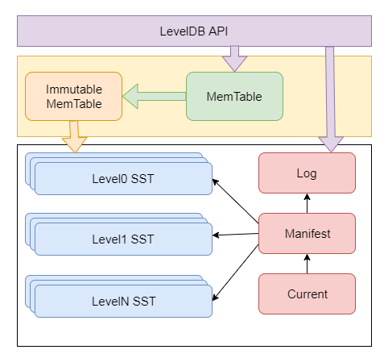

# Leveldb 源码阅读记录

> 对Leveldb源码进行分析学习

## 安装

```c++
git clone --recurse-submodules https://github.com/google/leveldb.git
mkdir -p build && cd build
cmake -DCMAKE_BUILD_TYPE=Release .. && cmake --build .
cd ..
sudo cp build/libleveldb.a /usr/local/lib/
sudo cp -r include/leveldb/ /usr/local/include/
```

## 设计思路 & 主要特性

- 基于[LSM-tree](https://www.bilibili.com/video/BV1Zz4y1r7BJ?t=1338)实现
- key和value都是任意长度的字节数组 
- 默认是按照key的字典顺序存储的，开发者可以重载这个排序函数
- 提供的基本操作接口：Put()、Delete()、Get()、Batch()
- 支持批量操作以原子操作进行
- 可以创建数据全景的snapshot(快照)，并允许在快照中查找数据
- 可以通过前向（或后向）迭代器遍历数据（迭代器会隐含的创建一个snapshot）
- 自动使用Snappy压缩数据
- 可移植性

## 总体架构



## 组成部分

- Log文件
写Memtable前会先写Log文件，Log通过append的方式顺序写入。Log的存在使得机器宕机导致的内存数据丢失得以恢复
- Memtable
内存数据结构，跳表实现。新的数据会首先写入这里
- Immutable Memtable
达到Memtable设置的容量上限后，Memtable会变为Immutable为之后向SST文件的归并做准备。Immutable Mumtable不再接受用户写入，同时生成新的Memtable、log文件供新数据写入
- SST文件
磁盘数据存储文件。SSTable(Sorted String Table)就是由内存中的数据不断导出并进行Compaction操作后形成的，而且SSTable的所有文件是一种层级结构，第一层为Level 0，第二层为Level 1，依次类推，层级逐渐增高，这也是为何称之为LevelDb的原因。除此之外，Compact动作会将多个SSTable合并成少量的几个SSTable，以剔除无效数据，保证数据访问效率并降低磁盘占用
- Manifest文件
Manifest文件中记录SST文件在不同Level的分布，单个SST文件的最大最小key，以及其他一些LevelDB需要的元信息
- Current文件
LevelDB启动时的首要任务就是找到当前的Manifest，而Manifest可能有多个。Current文件简单的记录了当前Manifest的文件名，从而让这个过程变得非常简单

## 参考

- [Leveldb](https://github.com/google/leveldb)